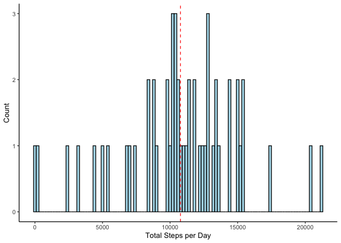
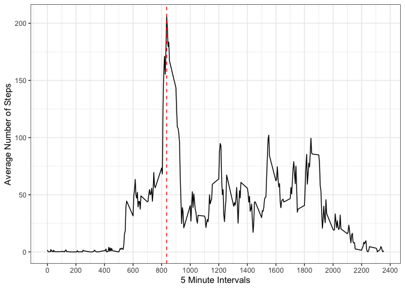
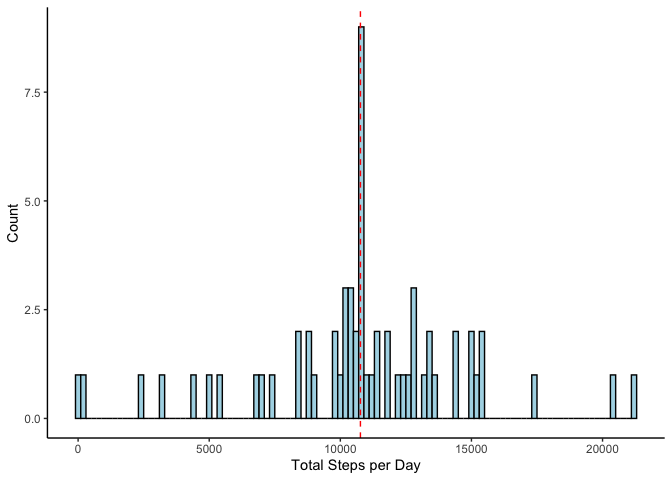
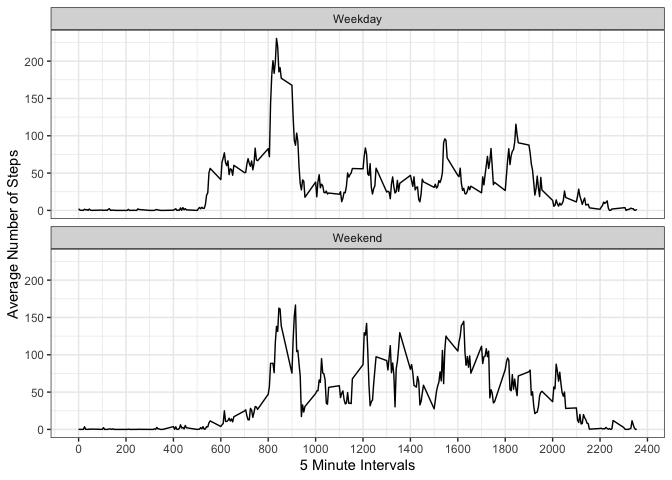

## Loading and preprocessing the data

Read in the data with read.csv change the date from class "character" to class "date"


```r
library(dplyr, verbose = FALSE)
```

```
## 
## Attaching package: 'dplyr'
```

```
## The following objects are masked from 'package:stats':
## 
##     filter, lag
```

```
## The following objects are masked from 'package:base':
## 
##     intersect, setdiff, setequal, union
```

```r
library(ggplot2)
dat <- read.csv("./activity.csv")

dat$date <- as.Date(dat$date, format = "%Y-%m-%d")

str(dat)
```

```
## 'data.frame':	17568 obs. of  3 variables:
##  $ steps   : int  NA NA NA NA NA NA NA NA NA NA ...
##  $ date    : Date, format: "2012-10-01" "2012-10-01" ...
##  $ interval: int  0 5 10 15 20 25 30 35 40 45 ...
```


## What is mean total number of steps taken per day?

#### Process the data

I have removed all of the rows with NA values for steps
Note there are two ways to do this, using sum(data, na.rm = TRUE) sets missing values to 0
Filtering it removes the rows enitrely - this is what I have chosen to do (I feel this is more correct)
All of my outputs are based on this choice

```r
dat1 <- dat %>% filter(!is.na(steps)) %>% group_by(date) %>% summarise(total_steps = sum(steps))
```

```
## `summarise()` ungrouping output (override with `.groups` argument)
```

```r
str(dat1)
```

```
## tibble [53 × 2] (S3: tbl_df/tbl/data.frame)
##  $ date       : Date[1:53], format: "2012-10-02" "2012-10-03" ...
##  $ total_steps: int [1:53] 126 11352 12116 13294 15420 11015 12811 9900 10304 17382 ...
```

#### Create a histogram

Vertical line at the mean

```r
ggplot(dat1, aes(x = total_steps)) +
        geom_histogram(binwidth = 200, colour = "black", fill = "lightblue") +
        geom_vline(xintercept = mean(dat1$total_steps),
                   colour = "red", lty = 2, lwd = 0.5) +
        theme_classic() +
        ylab("Count") +
        xlab("Total Steps per Day")
```

<!-- -->

#### Calculate mean and median


```r
mean(dat1$total_steps)
```

```
## [1] 10766.19
```

```r
quantile(dat1$total_steps, 0.5)
```

```
##   50% 
## 10765
```

## What is the average daily activity pattern?

#### Prepare the data

In this case we can just use mean(data, na.rm = TRUE), it doesn't impute missing values to be 0

```r
dat2 <- dat %>% group_by(interval) %>% summarise(average_steps = mean(steps, na.rm = TRUE))
```

```
## `summarise()` ungrouping output (override with `.groups` argument)
```

```r
str(dat2)
```

```
## tibble [288 × 2] (S3: tbl_df/tbl/data.frame)
##  $ interval     : int [1:288] 0 5 10 15 20 25 30 35 40 45 ...
##  $ average_steps: num [1:288] 1.717 0.3396 0.1321 0.1509 0.0755 ...
```

#### Create a Time Series Plot


```r
ggplot(dat2, aes(x = interval, y = average_steps)) +
        geom_line() +
        theme_bw() +
        ylab("Average Number of Steps") +
        xlab("5 Minute Intervals") +
        geom_vline(xintercept = dat2[which.max(dat2$average_steps),]$interval,
                   colour = "red", lty = 2, lwd = 0.5) +
        scale_x_continuous(breaks = scales::pretty_breaks(n = 14))
```

<!-- -->

#### Calculate interval with the highest average number of steps


```r
dat2[which.max(dat2$average_steps),]$interval
```

```
## [1] 835
```

## Imputing missing values

#### Report the number of missing values

Easiest way is to make a boolean vector using is.na, and sum it to find the total number of missing values.

```r
sum(is.na(dat))
```

```
## [1] 2304
```

#### Impute missing values

I'm using the mean of each interval to impute missing values for that interval. It's simple, I would use knn for a more complicated analysis with more variable to impute. The mean by interval was already calculated in the earlier step, it is in dat2$average_steps. I can therefore match this dataframe to one of just the missing values.

```r
dat3 <- dat[which(is.na(dat$steps)),] ## Get missing values
dat4 <- right_join(dat3, dat2, by = "interval") %>% ## join the missing dataframe & dataframe with the means
        select(-steps) ## remove column of Nas
names(dat4) <- c("date", "interval", "steps") ## Rename columns for rbinding
dat5 <- rbind(dat[which(!is.na(dat$steps)),], dat4) ## rbind it together
length(dat5) == length(dat) ## Check dataframes are the same length
```

```
## [1] TRUE
```

```r
sum(is.na(dat5)) ## Check that there are no missing values
```

```
## [1] 0
```


#### Process the New Data for a histogram


```r
dat6 <- dat5 %>% group_by(date) %>% summarise(total_steps = sum(steps))
```

```
## `summarise()` ungrouping output (override with `.groups` argument)
```

```r
head(dat6)
```

```
## # A tibble: 6 x 2
##   date       total_steps
##   <date>           <dbl>
## 1 2012-10-01      10766.
## 2 2012-10-02        126 
## 3 2012-10-03      11352 
## 4 2012-10-04      12116 
## 5 2012-10-05      13294 
## 6 2012-10-06      15420
```


#### Create the new histogram

Vertical line at the mean

```r
ggplot(dat6, aes(x = total_steps)) +
        geom_histogram(binwidth = 200, colour = "black", fill = "lightblue") +
        geom_vline(xintercept = mean(dat6$total_steps),
                   colour = "red", lty = 2, lwd = 0.5) +
        theme_classic() +
        ylab("Count") +
        xlab("Total Steps per Day")
```

<!-- -->

#### Calculate mean and median


```r
mean(dat6$total_steps)
```

```
## [1] 10766.19
```

```r
quantile(dat6$total_steps, 0.5)
```

```
##      50% 
## 10766.19
```
The original mean was 10766.19, and is the same as the current one
The original median was 10765 and the new one is 10766.19

The mean did not change, while the median increased slightly.
In this case the values differ very little (they would have differed more had I done sum(data, na.rm = TRUE) instead of filtering them out). The histogram does look a bit different, it has a higher peak at the mean.

## Are there differences in activity patterns between weekdays and weekends?

#### Create a factor variable for weekdays and weekends


```r
dys <- weekdays(dat5$date)
dys.1 <- case_when(dys %in% c("Monday", "Tuesday", "Wednesday", "Thursday", "Friday") ~ "Weekday",
                   dys %in% c("Saturday", "Sunday") ~ "Weekend")
dys.2 <- as.factor(dys.1)

dat7 <- cbind(dat5, "DayOf" = dys.2)

str(dat7)
```

```
## 'data.frame':	17568 obs. of  4 variables:
##  $ steps   : num  0 0 0 0 0 0 0 0 0 0 ...
##  $ date    : Date, format: "2012-10-02" "2012-10-02" ...
##  $ interval: int  0 5 10 15 20 25 30 35 40 45 ...
##  $ DayOf   : Factor w/ 2 levels "Weekday","Weekend": 1 1 1 1 1 1 1 1 1 1 ...
```

#### Process data for plot


```r
dat8 <- dat7 %>% group_by(DayOf, interval) %>% summarise(average_steps = mean(steps))
```

```
## `summarise()` regrouping output by 'DayOf' (override with `.groups` argument)
```

```r
head(dat8)
```

```
## # A tibble: 6 x 3
## # Groups:   DayOf [1]
##   DayOf   interval average_steps
##   <fct>      <int>         <dbl>
## 1 Weekday        0        2.25  
## 2 Weekday        5        0.445 
## 3 Weekday       10        0.173 
## 4 Weekday       15        0.198 
## 5 Weekday       20        0.0990
## 6 Weekday       25        1.59
```

#### Create a Facetted Time Series Plot


```r
ggplot(dat8, aes(x = interval, y = average_steps)) +
        geom_line() +
        theme_bw() +
        facet_wrap(~DayOf, nrow = 2) +
        ylab("Average Number of Steps") +
        xlab("5 Minute Intervals") +
        scale_x_continuous(breaks = scales::pretty_breaks(n = 14))
```

<!-- -->

